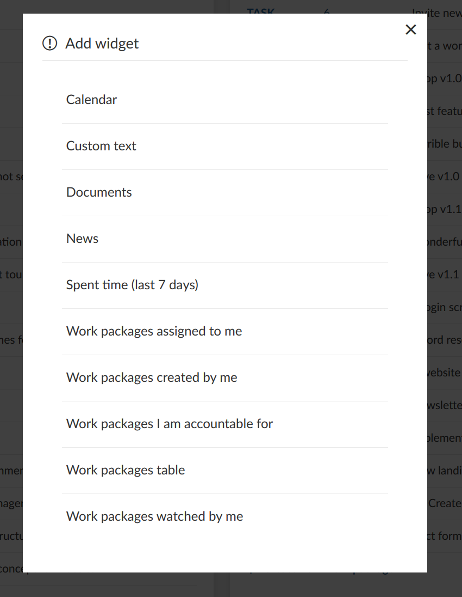
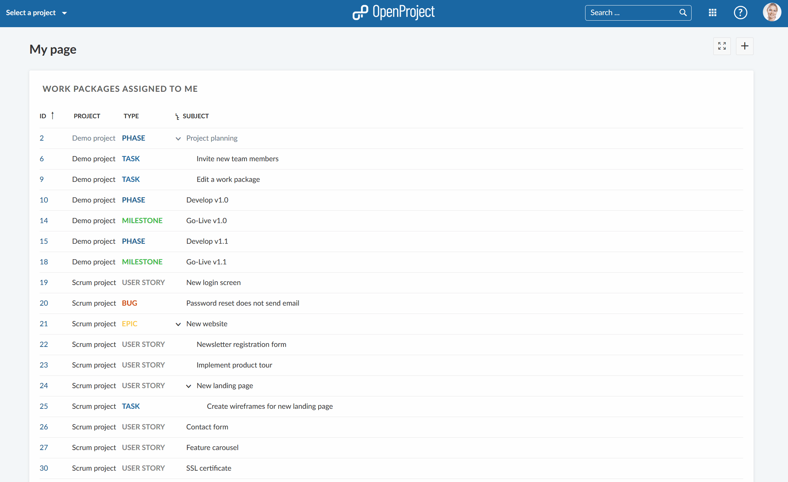
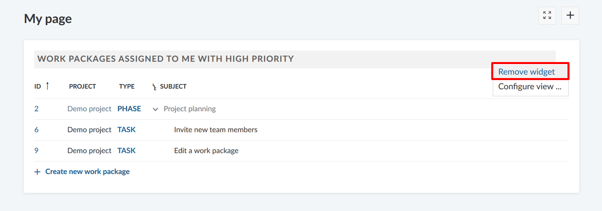

# My Page

The My Page is your personal dashboard with important overarching project information, such as work package reports, news, spent time, or a calendar. It can be configured to your specific needs.

| Feature                                                      | Documentation for                                  |
| ------------------------------------------------------------ | -------------------------------------------------- |
| [My Page introduction](#my-page-introduction)                | What is My Page and what can I do with it?         |
| [Configure the My Page](#configure-the-my-page)              | How to configure My Page?                          |
| [Add widgets](#add-widgets)                                  | How to add widgets to My Page?                     |
| [Change position of the widgets](#change-position-of-the-widgets) | How to change the position of a widget on My Page? |
| [Change the size of a widget](#change-the-size-of-a-widget)  | How to change the size of a widget?                |
| [Remove a widget](#remove-widget)                            | How to delete a widget on My Page?                 |

## My Page introduction

My Page is your personal dashboard where you can display important information of your projects. This personal dashboard contains information from all your projects. **My page** can be configured according to your preferences. You can include project information, for example the latest news, work packages assigned to you or reported work packages.

You can open your **My page** by clicking on your user avatar in the upper right corner and then selecting **My page** from the dropdown menu.

As a default, you will see two lists of all **work packages assigned to you** and **work packages created by you** from all your projects.

## Configure the My Page

### Add widgets

In order to **add a widget to My Page**, press the **+** icon on the top right corner of the page.

The dashboard shows the places where it is possible to add more widgets by displaying **+** icons.

Press a plus icon to add a widget to My Page at the according place.

Once you have chosen the place where to add the new widget on My Page, you can choose from a number of different widgets that can be included on your dashboard.

### Change position of the widgets

You can change the position of a widget on the dashboard with drag and drop.

Click the dots next to the title and drag it to the new place.

### Change the size of a widget

If you click the dots on the lower right hand corner in a widget you can change the size of a widget by pulling the widget left and right, up and down with the mouse.

### Configure the view of a widget (for work package tables)

You can configure the view of a work package widget to have the information included that you need.

On a work package widget, click the three dots and select **Configure view...**

You can configure the work package table (e.g. filter, group, highlight, sort) according to the [filter, sorting and grouping criteria for work packages](../../user-guide/work-packages/#work-package-table-configuration). 

### Remove a widget

To delete a widget from the dashboard, click on the three dots in the upper right corner of the widget and select **Remove widget**.

