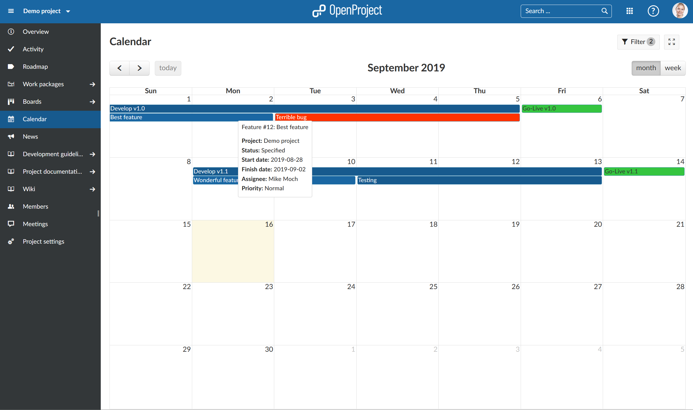
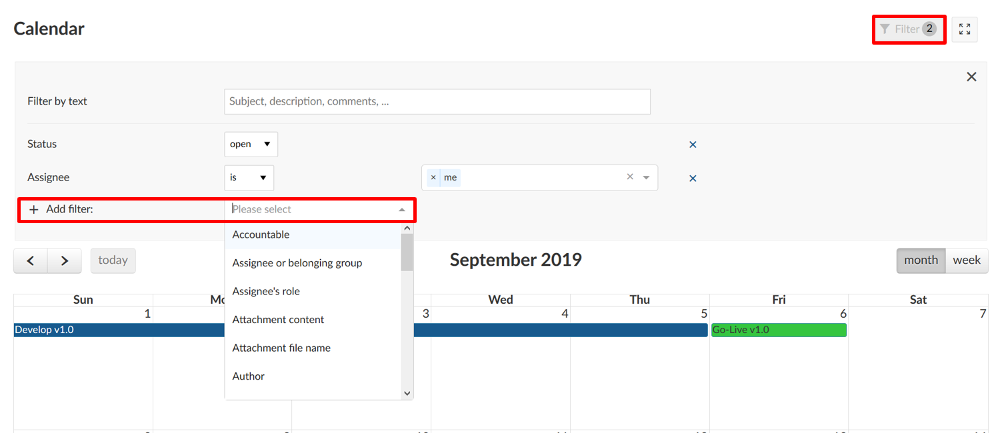
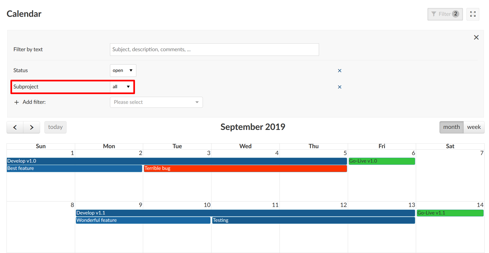

---
sidebar_navigation:
  title: Calendar
  priority: 840
description: Create a calendar in OpenProject.
robots: index, follow
keywords: calendar
---

# Calendar

The calendar shows all of the project’s work packages in calendar form. 

| Feature                                                      | Documentation for                                     |
| ------------------------------------------------------------ | ----------------------------------------------------- |
| [Calendar overview](#calendar-overview)                      | How to use the calendar in OpenProject.               |
| [Filters in calendar](#filters-in-calendar)                  | How to filter in the calendar view.                   |
| [Zen mode](#zen-mode)                                        | How to work distraction free in a calendar view.      |
| [Project overarching calendar](#project-orverarching-calendar) | How to display more than one project in the calendar. |
| [FAQ](#frequently-asked-questions-(faq))                     | Frequently asked questions                            |

## Calendar overview

To display the calendar in a project, the module **Calendar** needs to be activated in the [project settings](../projects/#activate-modules).

When you open the calendar, all work packages within the current project are displayed on the calendar, displaying the title of the work package. The colors represent the different [work package types](../../system-admin-guide/#work-package-types).

The current month is automatically selected. You can change the  date range between month or week and navigate through the views with the arrows on the left. The **today** button brings you back to the current date.

Hovering over one item displays more information to a work package, such as the type, status, start and finish date, assignee and priority, as well as the project to which the work package belongs.

Click on one item to open the work package details or to edit an item.

## Filters in calendar

You can filter the work packages in the calendar view by adding any number of filters, e.g. *Author*, *Due Date*, *Priority*, *Assignee*, etc.

Click the **Filter** button on the top right above the calendar to open the filter details.

To add another filter criteria, select the drop down next to **+ Add filter** and choose a filter criteria.

The number of different filter criteria is displayed on the filter button.

You can also display the calendar on the dashboard in the [project overview page](#project-overview).

## Zen mode

You can display the calendar in a full screen view to eliminate header and project menu and work distraction free.

Click the **Activate zen mode** button on the top of the calendar.

Click Escape (Esc) to leave the Zen mode.

## Project overarching calendar

It is possible to display the work packages from more than one project in the calendar. However, these projects need to be sub-projects of the current project.

Open the filter and select subproject as filter criteria.

Choose the sub-projects which you also want to display in the calendar view.

It is not possible to add work packages from projects which are not in a project hierarchy.

## Frequently asked questions (FAQ)

### What information can be displayed in the calendar?

The calendar automatically displays the start and end dates of work  packages in the current project. Additionally, the start and end dates of versions are shown in the calendar.

### Where can I embed / activate the calendar?

To use the calendar in a project, you need to [activate the “Calendar” module in the project settings](../projects/#activate-modules). Afterwards you can access the calendar in the project menu, as well as add it in the [project overview](#project-overview). You can also enable the calendar in your [“My page” view](#my-page).

### Is there an option to export or sync the calendar?

It is currently not possible to export or sync the calendar. You can however [export meetings as iCalendar file](#meetings) and import them to your external calendar.
